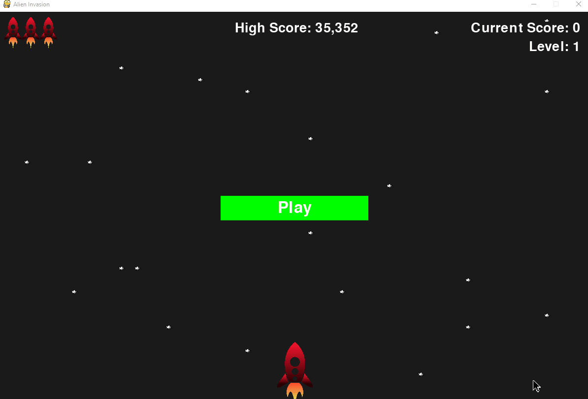

# Alien-Invasion
Arcade game is written in Python 3 and uses Pygame package module with higher order game logic dynamics.

## About the game
The game initials the space craft to shoot down incoming aliens and the counter keeps score.  If alien encounters and shoots the player then points get deducted. The game is a standard shooter where the player tries to avoid the lasers and fight back and get doubled the points. The AI is well callobrated to make the player is equally challenged. Assert the collaberation of algorithms to make this work. Manipulating Data collected.

## Gameplay


## Play yourself

1. Click [here](https://github.com/thisisglee/Alien-Invasion/archive/main.zip) to download the app
2. Install Python 3 and double click the alien_invasion.py file.
3. Play using arrow keys to steer the ship and spacebar to shoot bullets

## Build the App

1. Install latest pygame to edit and use the modules on the go.
 ```
    python3 -m pip install pygame
 ```
2. After installing just run the following command.

 ```
    python3 alien_invasion.py
 ```

## Credits
Initially inspired by [Eric Matthes](https://ehmatthes.github.io/). Thank you so much for the amazing guidance.

## License

- App: MIT

